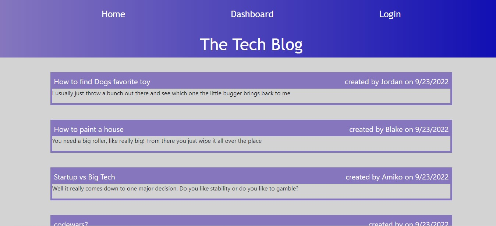

# Tech-Blog
This app is a blog site that allows users to make an account, post to the blog and comment on other users posts.

## Table of Contents
- [Installation](#Installation)
- [Usage](#Usage)
- [Contributing](#Contributing)
- [Technologies](#Technologies)
- [Questions](#Questions)
- [Acknowledgments](#Acknowledgments)

## Installation
This app is intalled in the Heroku cloud. Try it out at the following link  

## Usage 
Upon readching the site you will see the homepage with the most recent blog posts posted to the page. Shown below:

## Contributing 
Here are the steps in order to contribute to this project.
1. **Fork** the repo on GitHub
2. **Clone** the project to your own machine
3. **Commit** changes to your own branch
4. **Push** your work back up to your fork
5. Submit a **Pull Request** so that we can review your changes

NOTE: Be sure to merge the latest from `main` before making a pull request!

## Technologies
- JavaScript
- Node.JS(using Express, sequelize,bcyrpt,connect-session-sequelize, express-handlebars, express-session and dotenv 3rd party modules)
- SQL database through mysql2 node package module 

## Questions
Please refer any questions or problem issues to bhoff1980@gmail.com.

## Acknowledgments
Andres Jimenez (Tudor)  
Kirtley Adams (Teaching Assistant)  
Dan Kaltenbaugh (Instructor) 
George Yoo (Teaching Assisstant)
